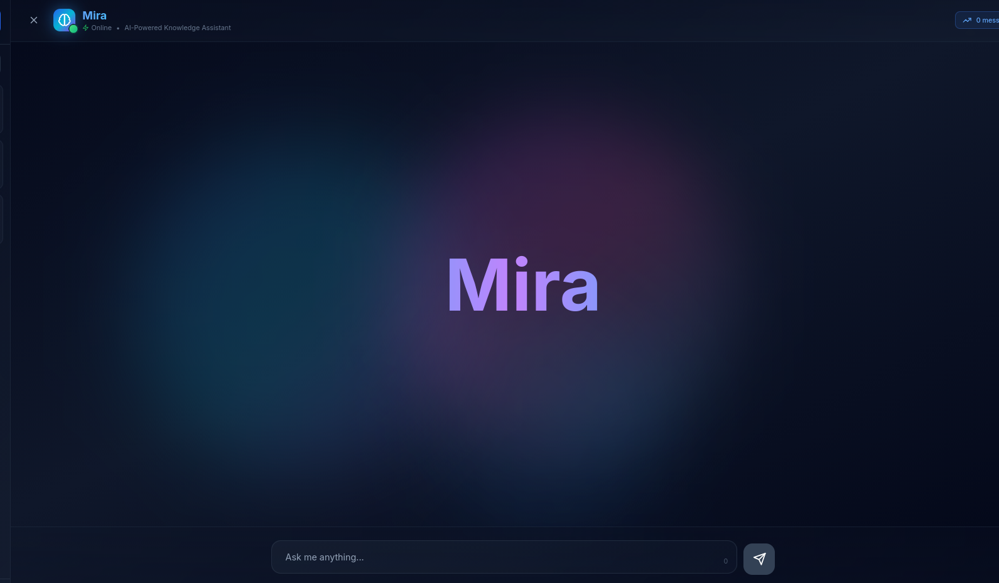
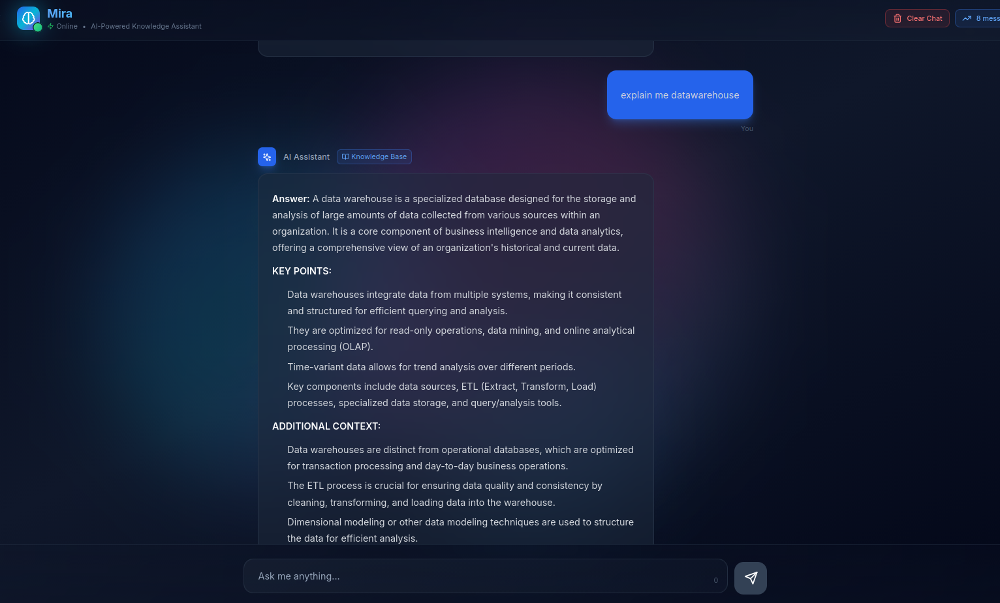

<div align="center">

# 🤖 Mira

### AI-Powered Knowledge Assistant with RAG & Redis Caching

*Transform your documents into an intelligent, conversational knowledge base*

[](https://github.com/gaurav-163/Mira)
[](https://www.python.org/)
[](https://nextjs.org/)
[](https://redis.io/)
[](LICENSE)

[Features](#-key-features) • [Quick Start](#-quick-start) • [Documentation](#-documentation) • [API](#-api-reference) • [Contributing](#-contributing)

</div>

---

## 📸 Screenshots

<div align="center">

### Modern Chat Interface


*Glassmorphism UI with gradient animations and typing effects*

### Knowledge Base Dashboard


*Document management with real-time vector indexing*

</div>

---

## ✨ Key Features

### ⚡ **Performance**
- 🚀 **Redis Caching**: 490x faster responses (14.7s → 0.03s)
- 🔄 **Dual Redis Architecture**: Local + cloud fallback
- 📊 **Smart Cache**: 24-hour TTL with auto-invalidation
- ⚡ **Optimized RAG**: Hybrid search with query expansion

### 🤖 **AI Capabilities**
- 🎯 **Hybrid Intelligence**: Auto-route between knowledge base & general AI
- 📚 **Semantic Search**: Advanced retrieval with RRF ranking
- 🔍 **Multi-Query**: Query expansion for better accuracy
- 📄 **OCR Support**: Process scanned PDFs (Tesseract/EasyOCR)

### 🎨 **Modern UI**
- ✨ **Glassmorphism**: Frosted glass design elements
- 🌈 **Animated Gradients**: Flowing blue-cyan-purple colors
- ⌨️ **Typing Effect**: Smooth "Mira" branding animation
- 💫 **Smooth Transitions**: Hover effects and scale animations
- 📱 **Responsive**: Works on desktop, tablet, and mobile

---

## 📋 Prerequisites

| Component | Version | Check Command |
|-----------|---------|---------------|
| **Python** | 3.10+ | `python --version` or `python3 --version` |
| **Node.js** | 18+ | `node --version` |
| **npm** | 9+ | `npm --version` |
| **Redis** | 7.0+ | `redis-server --version` or `redis-cli --version` |
| **Git** | Any | `git --version` |

---

## 🚀 Installation

### Step 1: Install Prerequisites

<details>
<summary><b>🪟 Windows</b></summary>

```powershell
# Install Chocolatey (if not installed)
# Run PowerShell as Administrator
Set-ExecutionPolicy Bypass -Scope Process -Force
[System.Net.ServicePointManager]::SecurityProtocol = [System.Net.ServicePointManager]::SecurityProtocol -bor 3072
iex ((New-Object System.Net.WebClient).DownloadString('https://community.chocolatey.org/install.ps1'))

# Install Python
choco install python --version=3.10.0 -y

# Install Node.js
choco install nodejs-lts -y

# Install Redis (use Memurai - Redis alternative for Windows)
choco install memurai-developer -y

# OR download Redis for Windows from:
# https://github.com/microsoftarchive/redis/releases
# Extract and run redis-server.exe

# Install Tesseract OCR (optional, for scanned PDFs)
choco install tesseract -y

# Restart PowerShell and verify
python --version
node --version
npm --version
redis-server --version
```

**Alternative: Manual Installation**
1. **Python**: Download from [python.org](https://www.python.org/downloads/)
2. **Node.js**: Download from [nodejs.org](https://nodejs.org/)
3. **Redis**: Download [Memurai](https://www.memurai.com/get-memurai) or [Redis for Windows](https://github.com/tporadowski/redis/releases)
4. **Tesseract**: Download from [UB-Mannheim](https://github.com/UB-Mannheim/tesseract/wiki)

</details>

<details>
<summary><b>🐧 Linux (Ubuntu/Debian)</b></summary>

```bash
# Update package list
sudo apt update

# Install Python 3.10+
sudo apt install python3 python3-pip python3-venv -y

# Install Node.js 18+
curl -fsSL https://deb.nodesource.com/setup_18.x | sudo -E bash -
sudo apt install nodejs -y

# Install Redis
sudo apt install redis-server -y
sudo systemctl enable redis-server
sudo systemctl start redis-server

# Install Tesseract OCR (optional)
sudo apt install tesseract-ocr -y

# Verify installations
python3 --version
node --version
npm --version
redis-server --version
```

</details>

<details>
<summary><b>🍎 macOS</b></summary>

```bash
# Install Homebrew (if not installed)
/bin/bash -c "$(curl -fsSL https://raw.githubusercontent.com/Homebrew/install/HEAD/install.sh)"

# Install Python
brew install python@3.10

# Install Node.js
brew install node@18

# Install Redis
brew install redis
brew services start redis

# Install Tesseract OCR (optional)
brew install tesseract

# Verify installations
python3 --version
node --version
npm --version
redis-server --version
```

</details>

---

### Step 2: Clone Repository

```bash
git clone https://github.com/gaurav-163/Mira.git
cd Mira
```

---

### Step 3: Configure Environment Variables

**Linux/macOS:**
```bash
cp .env.example .env
nano .env  # or vim, code, etc.
```

**Windows (PowerShell):**
```powershell
copy .env.example .env
notepad .env  # or code .env
```

**Edit `.env` with your API keys:**

```env
# Choose your LLM provider
LLM_PROVIDER=cohere          # Options: cohere, groq, openai

# Get free API keys from:
# Cohere: https://dashboard.cohere.com/api-keys (RECOMMENDED - Free tier)
# Groq: https://console.groq.com/keys (10x faster)
# OpenAI: https://platform.openai.com/api-keys (Paid)

COHERE_API_KEY=your-cohere-key-here
GROQ_API_KEY=your-groq-key-here
OPENAI_API_KEY=your-openai-key-here

# Redis Configuration (defaults work for local Redis)
REDIS_HOST=127.0.0.1
REDIS_PORT=6379
# REDIS_PASSWORD=  # Optional

# Optional: Self-reflection (improves quality, adds 2-3s)
ENABLE_REFLECTION=false
```

---

### Step 4: Install Dependencies

**Linux/macOS:**
```bash
# Create virtual environment (recommended)
python3 -m venv .venv
source .venv/bin/activate

# Install Python dependencies
pip install -r requirements.txt

# Install frontend dependencies
cd frontend
npm install
cd ..
```

**Windows (PowerShell):**
```powershell
# Create virtual environment
python -m venv .venv
.\.venv\Scripts\Activate.ps1

# If execution policy error, run:
# Set-ExecutionPolicy -ExecutionPolicy RemoteSigned -Scope CurrentUser

# Install Python dependencies
pip install -r requirements.txt

# Install frontend dependencies
cd frontend
npm install
cd ..
```

**Windows (Command Prompt):**
```cmd
# Create virtual environment
python -m venv .venv
.venv\Scripts\activate.bat

# Install Python dependencies
pip install -r requirements.txt

# Install frontend dependencies
cd frontend
npm install
cd ..
```

---

### Step 5: Add Your Documents (Optional)

**Linux/macOS:**
```bash
# Create knowledge base directory
mkdir -p data/knowledge_base

# Copy your PDF files
cp ~/Documents/*.pdf data/knowledge_base/
```

**Windows (PowerShell):**
```powershell
# Create knowledge base directory
New-Item -ItemType Directory -Force -Path data\knowledge_base

# Copy your PDF files
Copy-Item "C:\Users\YourName\Documents\*.pdf" -Destination "data\knowledge_base\"
```

---

### Step 6: Start Redis Server

**Linux:**
```bash
# Check if Redis is running
redis-cli ping
# Should return: PONG

# If not running, start it
sudo systemctl start redis

# Enable auto-start on boot
sudo systemctl enable redis
```

**macOS:**
```bash
# Check if Redis is running
redis-cli ping

# If not running
brew services start redis

# Or run in foreground
redis-server
```

**Windows:**
```powershell
# If using Memurai
net start Memurai

# OR if using Redis for Windows
# Navigate to Redis directory and run:
redis-server.exe

# In another terminal, verify
redis-cli.exe ping
# Should return: PONG
```

---

## 🏃 Running the Application

### Method 1: Using Start Scripts (Recommended for Linux/macOS)

**Terminal 1 - Backend:**
```bash
chmod +x start.sh  # First time only
./start.sh
```

**Terminal 2 - Frontend:**
```bash
cd frontend
chmod +x start-frontend.sh  # First time only
./start-frontend.sh
```

### Method 2: Manual Start (Works on All Platforms)

**Terminal 1 - Backend:**

**Linux/macOS:**
```bash
source .venv/bin/activate
uvicorn api:app --host 0.0.0.0 --port 8000 --reload
```

**Windows (PowerShell):**
```powershell
.\.venv\Scripts\Activate.ps1
uvicorn api:app --host 0.0.0.0 --port 8000 --reload
```

**Windows (Command Prompt):**
```cmd
.venv\Scripts\activate.bat
uvicorn api:app --host 0.0.0.0 --port 8000 --reload
```

**Terminal 2 - Frontend:**

**All Platforms:**
```bash
cd frontend
npm run dev
```

### Method 3: Python Direct Start (All Platforms)

**Terminal 1 - Backend:**
```bash
# Activate virtual environment first
python api.py
# OR
python3 api.py
```

**Terminal 2 - Frontend:**
```bash
cd frontend
npm install
npm run dev
```

---

## 🌐 Access the Application

Once both servers are running, open your browser:

| Service | URL | Description |
|---------|-----|-------------|
| **Frontend** | http://localhost:3000 | Main user interface |
| **Backend API** | http://localhost:8000 | REST API server |
| **API Docs** | http://localhost:8000/docs | Interactive Swagger docs |
| **Cache Stats** | http://localhost:8000/api/cache/stats | Redis cache statistics |

### Initial Setup

1. Open **http://localhost:3000** in your browser
2. Wait for **green "Online" indicator** in header (10-15 seconds)
3. Start asking questions!

---

## 📖 Usage Examples

### Knowledge Base Questions (from your PDFs)
```
- "What is data warehousing?"
- "Explain the main concepts in chapter 3"
- "Summarize the key findings"
- "What does the document say about machine learning?"
```

### General Knowledge Questions
```
- "What is Python?"
- "Explain quantum computing"
- "How does Redis caching work?"
- "What's the difference between SQL and NoSQL?"
```

### Redis Cache in Action

**First Time (Cache MISS):**
- Question: "What is data warehousing?"
- Response Time: **~14.7 seconds**
- Cached: **No**

**Second Time (Cache HIT):**
- Same Question: "What is data warehousing?"
- Response Time: **~0.03 seconds** ⚡
- Cached: **Yes**
- **490x faster!** 🚀

---

## 🛑 Stopping the Application

**Linux/macOS:**
```bash
# Use stop script
./stop.sh

# OR press Ctrl+C in both terminals
```

**Windows (PowerShell/CMD):**
```powershell
# Press Ctrl+C in both terminals

# OR manually kill processes
# Find processes
Get-Process python,node

# Kill specific process
Stop-Process -Name "python" -Force
Stop-Process -Name "node" -Force
```

**Stop Redis:**

**Linux:**
```bash
sudo systemctl stop redis
```

**macOS:**
```bash
brew services stop redis
```

**Windows:**
```powershell
# If using Memurai
net stop Memurai

# OR close redis-server window
```

---

## 🔧 API Reference

### Initialize Assistant
```bash
curl -X POST http://localhost:8000/api/initialize
```

**Response:**
```json
{
  "status": "initialized",
  "stats": {
    "documents": 1819,
    "pdfs": 3,
    "cache_enabled": true
  }
}
```

### Send Message
```bash
curl -X POST http://localhost:8000/api/chat \
  -H "Content-Type: application/json" \
  -d '{"message": "What is a data warehouse?"}'
```

### Get Cache Statistics
```bash
curl http://localhost:8000/api/cache/stats
```

**Response:**
```json
{
  "cache_enabled": true,
  "redis_host": "127.0.0.1:6379",
  "total_cached": 45,
  "cache_hits": 89,
  "cache_misses": 12,
  "hit_rate": "88.12%"
}
```

### Clear Cache
```bash
curl -X POST http://localhost:8000/api/cache/clear
```

### Clear Chat History
```bash
curl -X POST http://localhost:8000/api/clear
```

---

## 🐛 Troubleshooting

### Port Already in Use

**Linux/macOS:**
```bash
# Find process using port 8000
lsof -i :8000

# Kill it
kill -9 <PID>

# For port 3000
lsof -i :3000
kill -9 <PID>
```

**Windows (PowerShell):**
```powershell
# Find process using port 8000
netstat -ano | findstr :8000

# Kill it
taskkill /PID <PID> /F

# For port 3000
netstat -ano | findstr :3000
taskkill /PID <PID> /F
```

### Redis Not Running

**Linux:**
```bash
sudo systemctl status redis
sudo systemctl start redis
```

**macOS:**
```bash
brew services list
brew services start redis
```

**Windows:**
```powershell
# Check if Memurai is running
Get-Service Memurai

# Start it
net start Memurai

# OR launch redis-server.exe manually
```

### Python/Node Not Found

**Windows - Add to PATH:**
1. Search "Environment Variables" in Windows search
2. Click "Environment Variables"
3. Edit "Path" in System Variables
4. Add Python and Node.js installation directories
5. Restart terminal

**Typical paths:**
- Python: `C:\Python310\` and `C:\Python310\Scripts\`
- Node.js: `C:\Program Files\nodejs\`

### Virtual Environment Activation Error (Windows)

```powershell
# If you get execution policy error
Set-ExecutionPolicy -ExecutionPolicy RemoteSigned -Scope CurrentUser

# Then retry activation
.\.venv\Scripts\Activate.ps1
```

### Module Not Found Errors

```bash
# Make sure virtual environment is activated
# Then reinstall
pip install --upgrade -r requirements.txt
```

### Frontend Build Errors

```bash
cd frontend

# Clean install
rm -rf node_modules package-lock.json  # Linux/macOS
# OR
Remove-Item -Recurse -Force node_modules, package-lock.json  # Windows

# Reinstall
npm install --legacy-peer-deps
```

---

## 📊 Monitoring

### View Logs

**Linux/macOS:**
```bash
tail -f api.log
tail -f api.log | grep -i cache
tail -f api.log | grep -E "ERROR|Cache"
```

**Windows (PowerShell):**
```powershell
Get-Content api.log -Wait -Tail 50
Get-Content api.log -Wait | Select-String "cache"
```

### Monitor Redis

**All Platforms:**
```bash
# Connect to Redis CLI
redis-cli

# View all Mira keys
> KEYS mira:qa:*

# Get database size
> DBSIZE

# Monitor commands in real-time
> MONITOR

# View statistics
> INFO stats

# View memory usage
> INFO memory
```

---

## ⚙️ Configuration

### Performance Tuning

Edit `config.py`:

```python
# Vector Search
CHUNK_SIZE = 500              # Smaller = faster
CHUNK_OVERLAP = 50
TOP_K_RESULTS = 5
SIMILARITY_THRESHOLD = 0.3

# Redis Cache
CACHE_TTL = 86400            # 24 hours
CACHE_MAX_SIZE = 10000

# LLM Settings
TEMPERATURE = 0.1
MAX_TOKENS = 512
```

### Switch LLM Provider

```env
# Edit .env
LLM_PROVIDER=groq  # Change to groq, openai, or cohere
```

Then restart the backend.

---

## 🤝 Contributing

1. Fork the repository
2. Create your feature branch (`git checkout -b feature/AmazingFeature`)
3. Commit your changes (`git commit -m 'Add some AmazingFeature'`)
4. Push to the branch (`git push origin feature/AmazingFeature`)
5. Open a Pull Request

---

## 📄 License

MIT License - see [`LICENSE`](LICENSE) file for details.

---

## 🙏 Acknowledgments

- **[Cohere](https://cohere.com/)** - Powerful LLM API
- **[Redis](https://redis.io/)** - Lightning-fast caching
- **[LangChain](https://langchain.com/)** - RAG framework
- **[ChromaDB](https://www.trychroma.com/)** - Vector database
- **[Next.js](https://nextjs.org/)** - React framework

---

## 📞 Support

- 🐛 **Issues**: [GitHub Issues](https://github.com/gaurav-163/Mira/issues)
- 💬 **Discussions**: [GitHub Discussions](https://github.com/gaurav-163/Mira/discussions)
- 📖 **Documentation**: See `Docs` folder

---

<div align="center">

**Made with ❤️ by [Gaurav](https://github.com/gaurav-163)**

⭐ **Star this repo if you find it helpful!**

[🏠 Home](https://github.com/gaurav-163/Mira) • [🐛 Report Bug](https://github.com/gaurav-163/Mira/issues) • [✨ Request Feature](https://github.com/gaurav-163/Mira/issues)

</div>
